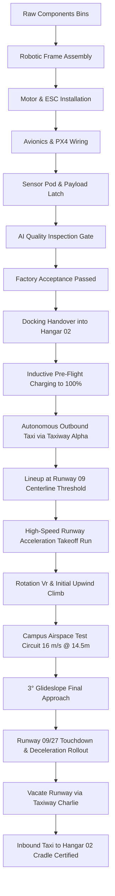

<div align="center">

# WareTwin
### Autonomous Drone Airbase & Robotic Manufacturing Digital Twin

*A high-fidelity 3D digital twin for autonomous drone manufacturing, 160-bay fleet docking, deterministic runway flight operations, and real-time PX4 telemetry simulation.*

[](LICENSE)
[](https://react.dev)
[](https://docs.pmnd.rs/react-three-fiber)
[](https://fastapi.tiangolo.com)
[](https://python.org)
[](https://developer.mozilla.org/en-US/docs/Web/JavaScript)
[](frontend/tests)
[](https://autonomous-drone-airbase-digital-tw.vercel.app/)

---

**Project Lead / Author:** [**Shah Mohammed Seaman**](https://www.linkedin.com/in/smsman/)  
**Organization Reference:** **URO Bangladesh**  
🌐 **Live Interactive 3D Digital Twin:** **[https://autonomous-drone-airbase-digital-tw.vercel.app/](https://autonomous-drone-airbase-digital-tw.vercel.app/)**

---

</div>

## 📌 Executive Summary

**WareTwin** is a full-scale, browser-native **3D Digital Twin** modeling an enterprise **Autonomous Drone Manufacturing & Operations Airbase** across a **300m × 200m master campus**.

The platform provides end-to-end digital twin simulation across two integrated domains:
1. **Robotic Drone Manufacturing**: Multi-workcell autonomous assembly lines with industrial robotic arms, carbon frame preparation, motor installation, avionics wiring, dynamic optical calibration, and AI-powered quality inspection gates.
2. **Autonomous Airbase Flight Operations**: A 160-bay multi-tier automated docking hangar, ground taxiway routing, 4 launch pads with 30m safety separation, and a **120m Runway 09/27** supporting high-speed takeoff acceleration runs, circuit test flights, and precision runway touchdown rollouts.

---

## 🏗️ Airbase Spatial Architecture & Facilities

The airbase follows an expansive 300m × 200m physical campus footprint with modern, realistic spatial zoning:

```text
 ┌─────────────────────────────────────────────────────────────────────────────┐
 │                           300m × 200m AIRBASE CAMPUS                        │
 │                                                                             │
 │  ┌─────────────────┐       ┌─────────────────┐       ┌──────────────────┐  │
 │  │    HANGAR 01    │       │    HANGAR 02    │       │   AVIONICS LAB   │  │
 │  │  Drone Robotic  │       │ 160 Docking Bay │       │   & MRO REPAIR   │  │
 │  │   Assembly Hall │       │  Fleet Storage  │       │     FACILITY     │  │
 │  └────────┬────────┘       └────────┬────────┘       └────────┬─────────┘  │
 │           │                         │                         │             │
 │  ═════════╧═════════════════════════╧═════════════════════════╧═══════════  │
 │                          SERVICE ROAD & TAXIWAY ALPHA                       │
 │                                                                             │
 │  ┌─────────────────┐       ┌────────────────────────────────────────────┐  │
 │  │ COMMAND CENTER  │       │               FLIGHT APRON                 │  │
 │  │  (Low-Profile   │       │   [PAD 01]   [PAD 02]   [PAD 03]   [PAD 04]  │  │
 │  │  Ground Center) │       └──────────────────────┬─────────────────────┘  │
 │  └─────────────────┘                              │                         │
 │                                                   │ TAXIWAY CHARLIE         │
 │  ─────────────────────────────────────────────────┴───────────────────────  │
 │                       RUNWAY 09/27 (120m × 14m)                             │
 │  ─────────────────────────────────────────────────────────────────────────  │
 └─────────────────────────────────────────────────────────────────────────────┘
```

### 1. Autonomous Command & Operations Center (X: -35, Z: 85)
* Ground-level, single-story modern facility positioned safely away from the runway.
* Completely eliminates legacy elevated airport tower/ATC concepts in favor of distributed autonomous fleet telemetry dashboards, geofence monitoring, and real-time mission planning.

### 2. Hangar 01: Drone Manufacturing Hall (X: -55, Z: 30)
* High-bay industrial facility equipped with 6 automated robotic assembly workcells:
  1. `COMPONENTS_PICKED`: Automated component retrieval.
  2. `FRAME_ASSEMBLY`: Carbon-fiber chassis jig alignment.
  3. `MOTOR_INSTALLATION`: High-torque brushless motor mounting.
  4. `AVIONICS_WIRED`: Flight controller, ESC, and harness wiring.
  5. `SENSORS_CALIBRATED`: 4K Gimbal Camera and LiDAR integration.
  6. `AI_QUALITY_CHECK`: Automated vision-based laser inspection gate.
  7. `CALIBRATION_CAGE`: Dynamic indoor test cage.

### 3. Hangar 02: Fleet Docking & Charging Hub (X: 50, Z: 35)
* Multi-tier automated docking racks providing **160 operational drone cradles**.
* Real-time dock telemetry monitoring occupancy, battery health, and inductive charging.

### 4. Runway 09/27 & Flight Apron
* **Runway 09/27**: 120m length × 14m width asphalt runway (`[110, 0, 160]`) with threshold markings, centerline dashes, touchdown zone markers, and edge lighting.
* **Flight Apron**: 4 dedicated VTOL landing pads (`PAD 01` to `PAD 04`) with 30m safety separation.
* **Taxiway Network**: Wide dual-direction taxiways connecting Hangar 01, Hangar 02, and the Flight Apron directly to Runway 09 and Runway 27 hold-short lines.

### 5. Avionics & Calibration Lab & MRO Overhaul
* Dedicated bench testing for avionics, IMU calibration, and heavy airframe maintenance.

---

## 🛸 Complete Autonomous Flight & Manufacturing Lifecycle

WareTwin simulates the complete lifecycle of autonomous drones from raw components to certified flight:



---

## 📁 Repository Structure & Directory Layout

The codebase follows a modular full-stack architecture cleanly separating the 3D presentation layer, client-side simulation, Python telemetry server, and automated verification suites:

```text
WareTwin/
├── backend/                      # Python FastAPI server & telemetry simulation
│   ├── app/                      # Application source code
│   │   ├── ai/                   # AI Copilot, live telemetry context, & camera VLM inspection
│   │   ├── sim/                  # 3D A* pathfinding, spatial grid, safety rules, & what-if branching
│   │   ├── db.py                 # Async SQLite state ledger & time-series event storage
│   │   ├── guard.py              # Operational safety guardrails & command validation
│   │   ├── main.py               # FastAPI application, REST endpoints, & WebSocket stream
│   │   ├── schema.py             # Pydantic data contracts for airbase state & telemetry
│   │   └── warehouse_layout.json # 300m × 200m spatial coordinates & facility boundaries
│   ├── tests/                    # Backend Pytest test suite (kinematics, guardrails, API)
│   ├── Dockerfile                # Container deployment specification (Fly.io / Cloud Run)
│   └── requirements.txt          # Production Python dependencies
│
├── frontend/                     # React 18, Three.js / R3F WebGL Digital Twin
│   ├── public/                   # Static assets, drone telemetry cards, and campus textures
│   ├── src/
│   │   ├── components/
│   │   │   ├── scene/            # 3D WebGL scene graphs (campus terrain, hangars, robotic arms, runways)
│   │   │   ├── panels/           # Telemetry dossiers, hangar fleet docks, manufacturing inspector, HUD
│   │   │   ├── ops/              # Scenario injection, what-if branching, and copilot drawers
│   │   │   ├── shell/            # Top bar navigation, camera presets, and live mission clock
│   │   │   ├── ui/               # Reusable UI primitives and focus management
│   │   │   └── views/            # Orthographic 2D tactical minimap & 3D perspective viewports
│   │   ├── layout/               # 2D/3D navigation grid, spatial zone definitions, and obstacle maps
│   │   ├── schema/               # Shared digital twin state contracts (JavaScript ES2022)
│   │   ├── services/             # WebSocket client with exponential backoff & auto-reconnect
│   │   ├── simulation/           # Client-side 60 Hz physics runner & deterministic A* router
│   │   ├── state/                # Zustand state stores (hangar fleet, manufacturing, digital twin)
│   │   ├── App.jsx               # Main application container and layout shell
│   │   ├── main.jsx              # DOM entrypoint
│   │   └── styles.css            # Dark enterprise theme and glassmorphism UI styles
│   ├── tests/                    # Vitest deterministic simulation test suite
│   ├── package.json              # Frontend dependencies and npm scripts
│   └── vite.config.js            # Vite bundler configuration
│
├── docs/                         # Architecture specifications and documentation media
│   ├── layout/                   # Layout generation script & campus spatial geometry
│   ├── media/                    # 1080p demonstration video tours and keyframe captures
│   ├── schema/                   # Dual Python/JavaScript state definition references
│   └── architecture.svg          # High-level system architecture vector diagram
│
├── scripts/                      # Automation & testing utilities
│   ├── record-airbase-demo.js    # Playwright automated 3-minute camera tour recording script
│   └── record-airbase-demo.sh    # End-to-end headless demo recording pipeline (Playwright + FFmpeg)
│
├── .github/workflows/ci.yml      # GitHub Actions CI pipeline (backend pytest + frontend test & build)
├── vercel.json                   # Root Vercel configuration for single-click deployment
├── LICENSE                       # MIT open source license
└── README.md                     # Comprehensive project documentation
```

---

## ⚡ Performance Optimization & 60 FPS Digital Twin Architecture

WareTwin is optimized to run smoothly at 60 FPS on integrated GPUs and standard developer laptops:
* **Throttled State Broadcasting**: High-frequency 60 FPS Three.js physics are decoupled from React Zustand updates, throttling React re-renders to an optimal 12 Hz (`tickAccumulator >= 0.08`).
* **Instanced Mesh Rendering**: 160-bay docking racks render with instanced geometries to minimize draw calls.
* **Unobstructed 3D Presentation**: Floating HTML boxes and obstructive text cards have been removed from the 3D viewport, rendering clean, 1.6× scaled industrial drone models with spinning rotors, landing skids, headlights, and altimeter beams.
* **GPU Memory Tuning**: Directional shadow maps capped to 2048×2048; device pixel ratio capped to `[1, 1.5]`.

---

## 🎬 Video Demonstration Tour & Keyframe Assets

A comprehensive 1080p demonstration video of the digital twin and its operational systems is included in the project:

* 🎥 **1080p MP4 Video**: [`docs/media/airbase_digital_twin_tour.mp4`](docs/media/airbase_digital_twin_tour.mp4) (30 MB, H.264 / MPEG-4)
* 🎥 **WebM Video**: [`docs/media/airbase_digital_twin_tour.webm`](docs/media/airbase_digital_twin_tour.webm) (4.5 MB)
* 🖼️ **High-Resolution Keyframe Captures**:
  - [`docs/media/scene1_manufacturing_overview.png`](docs/media/scene1_manufacturing_overview.png): 300m × 200m Campus Layout
  - [`docs/media/scene2_hangar_fleet_command.png`](docs/media/scene2_hangar_fleet_command.png): 160-Bay Hangar Fleet Management
  - [`docs/media/scene4_runway_takeoff_flight.png`](docs/media/scene4_runway_takeoff_flight.png): Runway 09 Acceleration Takeoff Run
  - [`docs/media/scene8_runway_touchdown_certified.png`](docs/media/scene8_runway_touchdown_certified.png): Runway Touchdown & Telemetry Dossier

---

## 🚀 Quick Start

### Prerequisites
* **Node.js**: v18.0 or higher
* **Python**: v3.11 or higher
* **npm** / **pip**

### 1. Start Frontend (3D UI & Digital Twin)
```bash
cd frontend
npm install
npm run dev
```
Open **`http://localhost:5173`** in any modern web browser.

### 2. Start Backend Simulation Server
```bash
cd backend
python3 -m venv .venv
source .venv/bin/activate  # On Windows: .venv\Scripts\activate
pip install -r requirements.txt
uvicorn app.main:app --host 0.0.0.0 --port 8000 --reload
```
API Documentation and Health Endpoint: **`http://localhost:8000/api/health`**

### 3. Run Automated Verification Test Suites
```bash
# Run frontend digital twin & kinematics test suite (32 tests)
cd frontend
npm test -- --run

# Run backend simulation & safety guardrails test suite (50 tests)
cd ../backend
pytest -q
```
*(All 82/82 deterministic simulation, kinematics, and safety tests pass).*

### 4. Production Deployment on Vercel
* 🌐 **Official Live URL**: **[https://autonomous-drone-airbase-digital-tw.vercel.app/](https://autonomous-drone-airbase-digital-tw.vercel.app/)**

The repository is pre-configured with root [`vercel.json`](vercel.json) and [`frontend/vercel.json`](frontend/vercel.json) for automatic CI/CD deployment on push. When you push updates to `main`, Vercel automatically builds and redeploys the digital twin in under 60 seconds.

---

## 🛠️ Technology Stack

| Layer | Technology |
| :--- | :--- |
| **3D Rendering** | Three.js, React Three Fiber (R3F), Drei, Postprocessing |
| **Frontend Framework** | React 18, JavaScript (ES2022 / JSX), Vite |
| **State Management** | Zustand (Decoupled 60 Hz Physics + 12 Hz Reactive Broadcasting) |
| **Backend Simulation** | Python 3.11, FastAPI, Uvicorn, WebSockets |
| **Routing & Kinematics**| Deterministic 8-Direction A*, Cell Reservation Grid, Spline Corridors |
| **Media & Automation** | Playwright Chromium, FFmpeg |

---

## 📄 License & Attribution

```text
MIT License

Copyright (c) 2026 Seaman / URO Bangladesh

Permission is hereby granted, free of charge, to any person obtaining a copy
of this software and associated documentation files (the "Software"), to deal
in the Software without restriction, including without limitation the rights
to use, copy, modify, merge, publish, distribute, sublicense, and/or sell
copies of the Software, and to permit persons to whom the Software is
furnished to do so, subject to the following conditions:

The above copyright notice and this permission notice shall be included in all
copies or substantial portions of the Software.
```

**Project Reference:** URO Bangladesh  
**Lead Developer:** Seaman 

